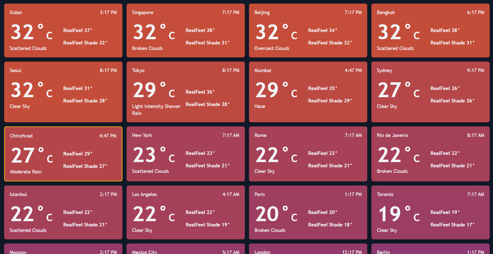

# Weather Leaderboard Application



A weather leaderboard application that displays the current weather and time for different cities, ranking them based on their temperature. The hottest cities are displayed at the top, and the temperatures are color-coded to visually represent how hot each city is.

## Table of Contents

-   [Features](#features)
-   [Demo](#demo)
-   [Tech Stack](#tech-stack)
-   [Installation](#installation)
-   [Usage](#usage)
-   [API](#api)
-   [Contributing](#contributing)
-   [License](#license)
-   [Contact](#contact)

## Features

-   Displays current weather details of various cities.
-   Ranks cities based on their current temperature, from hottest to coolest.
-   Color codes cities based on their temperature.
-   Responsive design with Tailwind CSS.
-   Easy to navigate and visually appealing UI.

## Demo

Check out the live application here: [Weather Leaderboard](https://weather-leaderboard.onrender.com/)

## Tech Stack

-   **Frontend**: React, Tailwind CSS
-   **Backend**: Node.js, Express
-   **API**: OpenWeatherMap API (or your chosen weather data provider)
-   **Styling**: Tailwind CSS

## Installation

1. **Clone the repository:**

    ```bash
    git clone https://github.com/your-username/weather-leaderboard.git
    cd weather-leaderboard
    ```

2. **Install dependencies for the backend:**

    ```bash
    cd server
    npm install
    ```

3. **Install dependencies for the frontend:**

    ```bash
    cd ../client
    npm install
    ```

## Usage

### Running the Application

1. **Start the backend server:**

    ```bash
    cd server
    npm start
    ```

2. **Start the frontend:**

    ```bash
    cd ../client
    npm start
    ```

3. The application will be running at `http://localhost:3000`.

### Configuration

-   Create a `.env` file in the `server` directory to add your environment variables:

    ```plaintext
    PORT=5000
    WEATHER_API_KEY=your_openweathermap_api_key
    ```

## API

The backend server fetches weather data from the OpenWeatherMap API (or your weather data provider). Ensure you have an API key, which you can obtain by signing up on their platform.

### Endpoints

-   **GET /api/weather**: Fetches weather data for all configured cities.
-   **POST /api/weather**: Post lat and lon.

## Contributing

Contributions are welcome! Please follow these steps:

1. Fork the repository.
2. Create a new branch: `git checkout -b feature-branch`.
3. Make your changes and commit: `git commit -m 'Add new feature'`.
4. Push to the branch: `git push origin feature-branch`.
5. Open a pull request.

## License

This project is licensed under the MIT License. See the [LICENSE](LICENSE) file for details.

## Contact

For any questions or feedback, please contact:

-   **Email**: gaikwadvarun23@gmail.com
-   **GitHub**: [VarunGaikwad](https://github.com/VarunGaikwad)
